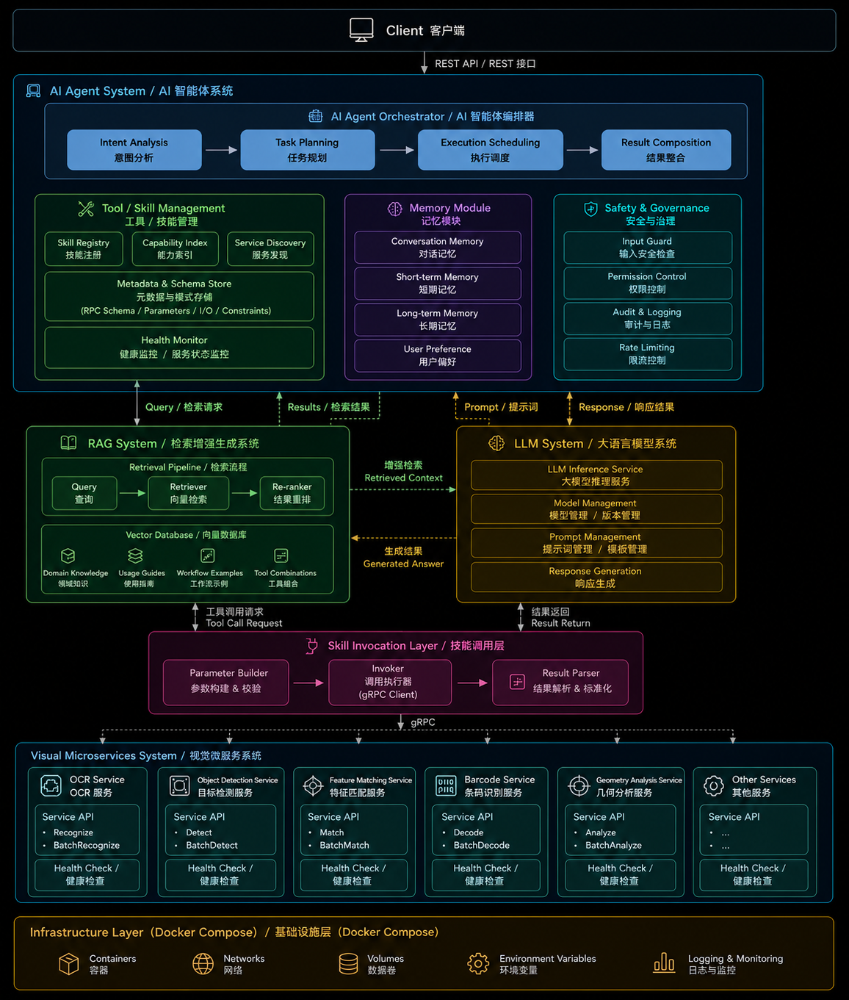

# CvHub AI Vision Agent Platform
## Overview

The CvHub AI Vision Agent Platform is an intelligent computer vision platform built around AI Agents, Large Language Models (LLMs), Retrieval-Augmented Generation (RAG), and Visual Microservices.

Rather than focusing on a single computer vision algorithm, the platform aims to build an intelligent system capable of understanding user requests, planning execution workflows, invoking multiple visual capabilities, and generating comprehensive results.

The entire platform adopts a microservices-based architecture with Docker-native deployment. AI Agent, LLM, RAG, and all computer vision tools are designed as independent modules that can be developed, deployed, upgraded, and scaled independently.

The platform consists of six core systems:

- AI Agent System
- RAG System
- LLM System
- Skill Invocation Layer
- Visual Microservices
- Infrastructure Layer
## Project Structure


## Client

The Client serves as the entry point for user interaction.

Future client implementations may include:

- Web
- Desktop
- Mobile
- REST-API

The Client communicates exclusively with the AI Agent.

Users do not need to know how many visual services, LLMs, or RAG components exist behind the system, nor which tools are used to complete a particular task.

## AI Agent System Layer

The AI Agent is the orchestration layer of the platform.

It is responsible for understanding user intentions, planning execution workflows, coordinating different systems, and composing the final response.

The Agent itself neither stores knowledge nor performs language model inference directly. Instead, it orchestrates the interactions between the RAG system, the LLM system, and the Visual Services.

The AI Agent consists of the following core modules.

### AI Agent Orchestrator

The execution engine of the AI Agent.

It manages the complete workflow of every task.

Main responsibilities include:

- Intent Analysis
  - Understand the user's actual request.
- Task Planning
  - Break complex requests into executable subtasks.
- Execution Scheduling
  - Determine tool execution order
  - Parallel execution
  - Retry handling
  - Timeout management
  - Workflow orchestration
- Result Composition
  - Aggregate outputs from multiple tools
  - Generate the final response

The Orchestrator serves as the `CPU` of the AI Agent.

### Tool / Skill Management

Responsible for managing all available tools within the platform.

#### Skill Registry

Maintains the registry of all available visual tools.

Examples include:

- OCR
- Object Detection
- Feature Matching
- Geometry Analysis

#### Capability Index

Describes the capabilities of each tool.

The Agent uses this capability index to determine which tools should be invoked for a given task.

#### Service Discovery

Maintains the network locations of all microservices.

This component can later be replaced by solutions such as Consul or Kubernetes Service Discovery.

#### Metadata & Schema Store

Maintains the interface definitions for every tool.

Including:

- Proto definitions
- RPC schemas
- Input specification
- Output specification
- Parameters
- Constraints

The Agent does not hardcode tool implementations. Instead, requests are dynamically constructed based on the stored schemas.

#### Health Monitor

Continuously monitors the health of every service.

Examples:

- Service availability
- Model loading status
- GPU availability
- Request readiness

Healthy services are prioritized during task scheduling.

### Memory Module

The Memory Module maintains the runtime state of the AI Agent.

#### Short-Term Memory

Stores the context of the current task.

Examples:

- Current workflow state
- Intermediate tool results
- Runtime variables

#### Long-Term Memory

Stores persistent user-related information.

Examples:

- User preferences
- Frequently used parameters
- Historical tasks

Memory belongs to the Agent runtime and should not be confused with the knowledge base used by RAG.

### Safety & Governance

Responsible for system-wide security and governance.

Including:

- Input Security
  - Prompt injection detection
  - Malicious request filtering
- Access Control
  - User permissions
  - Tool permissions
- Logging
  - Tool invocation logs
  - Workflow execution logs
- Rate Limiting

## RAG System Layer

The RAG System is designed as an independent subsystem.

Its responsibility is knowledge retrieval rather than workflow orchestration.

This separation allows the knowledge system to evolve independently from the AI Agent.

The RAG System consists of:

### Retrieval Pipeline

Responsible for:

```text
Query
    ↓
Retriever
    ↓
Re-ranker
    ↓
Retrieved Context
```

### Vector Database

Stores the platform's knowledge base.

Examples include:

- Technical documentation
- API documentation
- Tool manifests
- Workflow examples
- Prompt templates
- Service documentation
- Development guidelines

All documents are first split into chunks, converted into embeddings, and stored in a vector database.

When additional context is required, the Agent retrieves relevant information through the RAG system before sending it to the LLM for reasoning.

## LLM System Layer

The LLM System is designed as an independent inference service.

Its sole responsibility is to receive inference requests from the AI Agent, perform language model inference, and return the generated results.

The LLM System does not manage prompts, workflows, memory, RAG retrieval, or tool execution. These responsibilities belong to the AI Agent System.

The current implementation uses **vLLM** as the inference engine and **Qwen** as the deployed language model.

### LLM Inference

The LLM System receives a complete inference request from the AI Agent.

A request typically includes:

- System prompt
- User request
- Conversation context
- Retrieved RAG context
- Generation parameters

The LLM System performs inference and returns:

- Generated response
- Token usage
- Inference metadata

The LLM System is intentionally designed to be stateless. It only performs model inference and does not retain conversation state or business logic.

### Inference Engine

The current implementation is based on **vLLM**, which provides efficient model serving and high-throughput inference.

The AI Agent communicates with the LLM System through a unified interface, allowing the underlying inference engine or model to be replaced in the future without affecting the overall system architecture.

## Skill Invocation Layer

The Skill Invocation Layer bridges the AI Agent and the Visual Services. It provides a unified interface for invoking all tools.

### Parameter Builder

Transforms Agent outputs into tool requests.

Responsibilities include:

- Parameter validation
- Default parameter generation
- Data conversion

### Invoker

Provides a centralized gRPC client layer.

All tool invocations are routed through this component instead of being called directly by the Agent.

## Visual Microservices Layer

All computer vision capabilities are implemented as independent microservices.

Each tool corresponds to:

- An independent Git repository
- An independent Docker container
- An independent gRPC service

Each service is fully decoupled from the others and can be developed, deployed, tested, and upgraded independently.

Examples include:

- OCR Service
- Object Detection Service
- Feature Matching Service
- Barcode Service
- Geometry Analysis Service

New visual capabilities can be added without modifying the Agent architecture.

### Service Contracts

All services share a common contract definition.

Including:

- Proto files
- Schemas
- Shared models
- Metadata
- common.proto
- image.proto
- metrics.proto

This ensures interface consistency and version compatibility across all microservices.

### Tool Design Principles

Each Tool should represent a complete business capability rather than a single algorithmic step.

For example, an OCR service should accept an image as input and return:

- Recognized text
- Bounding boxes
- Confidence scores

Instead of exposing internal processing stages。

The Agent should always interact with complete business capabilities.

Each Tool should satisfy the following principles:

- Independent business objective
- Stable input/output interface
- Independent Docker container
- Independent Git repository
- Independent deployment
- Independent versioning
- Independent testing
- Fault isolation

## Infrastructure Layer

The entire platform is designed for Docker-native deployment.

Independent containers are provided for:

- AI Agent
- RAG System
- LLM System
- Visual Services

The Infrastructure Layer is responsible for:

- Containers
- Networks
- Volumes
- Environment variables
- Logging
- Monitoring

The current deployment solution is based on Docker Compose.

In the future, the platform can be migrated to Kubernetes to support automatic scaling, service discovery, load balancing, and high availability.