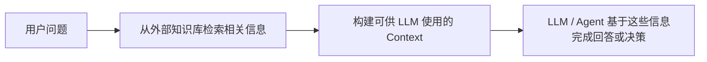
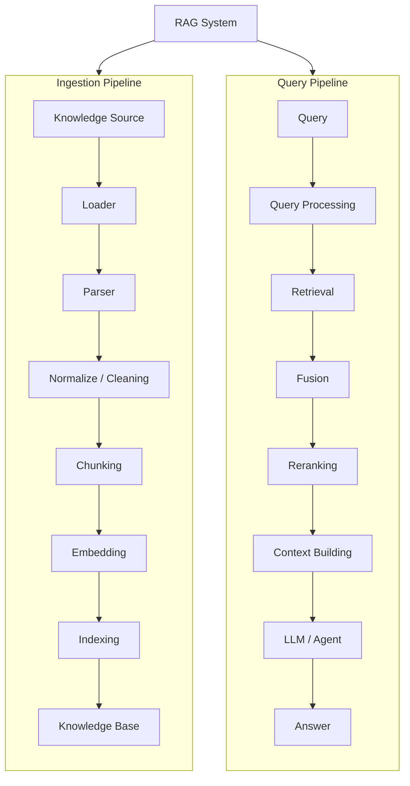
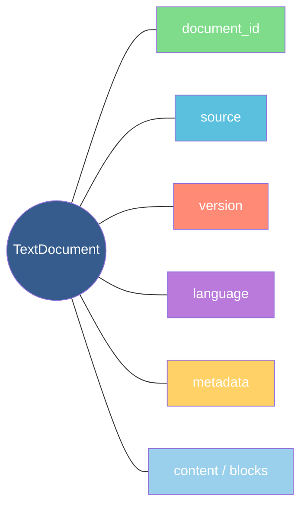

# RAG 总体体系与架构

## 1. RAG 是什么

**RAG = Retrieval-Augmented Generation，检索增强生成。**

核心思想：



RAG 的主要价值包括：

- 让 LLM 使用私有知识或领域知识
- 让知识可以独立于 LLM 参数进行更新
- 为回答提供可追踪的来源
- 通过可靠外部知识降低幻觉风险

需要注意：

> RAG 可以降低幻觉，但不能保证完全消除幻觉。知识库质量、Retrieval 质量和生成阶段都会影响最终结果。

---

## 2. RAG 的完整生命周期

一个完整 RAG 系统可以分成两条主链：


---

## 3. RAG 的核心数据对象

### Document

表示一个完整知识来源，例如：

- PDF
- Markdown
- HTML
- XML
- Word
- 数据库记录
- API 数据

典型信息：



### StructuredDocument

Parser 处理后的结构化文档。

例如：

```text
StructuredDocument
├── Title
├── Section
│   ├── Heading
│   ├── Paragraph
│   └── Table
└── Section
    ├── Paragraph
    └── Figure
```

### Chunk

Chunk 是 Retrieval 的基本知识单元。

```text
Chunk
├── chunk_id
├── document_id
├── text
├── metadata
└── source reference
```

### Embedding

Embedding 是 Chunk 或 Query 的向量表示：

```text
Text
 ↓
Embedding Model
 ↓
[0.13, -0.72, 0.44, ...]
```

### RetrievalResult

Retriever 返回的候选结果可以抽象为：

```text
RetrievalResult
├── chunk
├── score
├── source
├── metadata
└── retrieval_method
```

---

## 4. 核心组件

### Document Loader

职责：

> 获取原始数据。

来源可以是：

- 文件
- Object Storage
- Database
- Web
- API

Loader 重点解决“如何读取”，而不是复杂的文档理解。

### Document Parser

职责：

> 将原始内容恢复为统一的结构化文档。

主要关注：

- Title
- Heading
- Paragraph
- Table
- Figure
- Caption
- Reading Order
- Page
- Bounding Box

### Normalizer / Cleaner

职责：

> 清理 Parser 输出并统一数据结构。

例如：

- Header / Footer Removal
- Deduplication
- Encoding Cleaning
- Cross-page Merge
- Metadata Normalization

### Chunker

职责：

> 将 StructuredDocument 转换成适合 Retrieval 的知识单元。

### Embedder

职责：

> Text → Embedding Vector。

### Vector Store / Index

职责：

> 保存向量及其与 Chunk 的映射，并支持高效相似度搜索。

### Retriever

职责：

> 根据 Query 找到相关知识。

常见方法：

- Dense Retrieval
- BM25 / Sparse Retrieval
- Metadata Filtering
- Hybrid Retrieval

### Fusion

职责：

> 将多个 Retriever 的结果组合成统一候选集。

例如：

```text
Vector Retriever ─┐
                  ├→ Fusion
BM25 Retriever ───┘
```

### Reranker

职责：

> 使用更精确的方法重新判断候选结果与 Query 的相关性。

### Context Builder

职责：

> 从最终 Retrieval Results 构建真正交给 LLM / Agent 的 Context。

### Generator / Agent

在传统 RAG 中：

```text
Context
 ↓
Prompt Builder
 ↓
LLM
 ↓
Answer
```

在 Agent 架构中也可以：

```text
RAG
 ↓
Retrieval Context
 ↓
Agent
 ↓
LLM / Tools
```

因此 RAG 与 Generation 是否属于同一个服务，是系统架构选择，不是 RAG 概念上的硬性要求。

---

## 5. Dense、Sparse 与 Hybrid Retrieval

### Dense Retrieval

```text
Query
 ↓
Embedding
 ↓
Vector Search
```

主要解决语义相似问题。

### Sparse Retrieval

典型方法：

```text
BM25
```

擅长：

- 精确关键词
- 产品编号
- 错误代码
- 专有名词
- 特殊缩写

### Hybrid Retrieval

```text
Dense Retrieval
       +
Sparse Retrieval
       ↓
     Fusion
```

目的：

> 同时利用语义相似和关键词匹配能力。

---

## 6. Metadata 的作用

Chunk 不应该只有 Text。

典型 Metadata：

```text
document_id
document_version
page
section
heading_path
chunk_type
language
source
bbox
created_at
```

Metadata 可以用于：

- Retrieval Filter
- Citation
- Debugging
- Version Management
- Access Control
- Evaluation

---

## 7. RAG 的质量链

最终效果不是由某一个模型决定的。

```text
Source Quality
      ↓
Parsing Quality
      ↓
Chunk Quality
      ↓
Embedding Quality
      ↓
Retrieval Quality
      ↓
Reranking Quality
      ↓
Context Quality
      ↓
Generation Quality
```

任何一层出现问题，都可能导致最终回答失败。

因此：

> RAG 的优化应该基于 Evaluation，而不是只根据某一个模块的输出是否“看起来合理”。

---

## 8. RAG 的主要能力层

可以将整个体系理解为：

```text
RAG
│
├── Knowledge Ingestion
│   ├── Loading
│   ├── Parsing
│   ├── Cleaning
│   └── Chunking
│
├── Knowledge Representation
│   ├── Embedding
│   ├── Metadata
│   ├── Vector Store
│   └── Index
│
├── Retrieval
│   ├── Query Processing
│   ├── Dense Retrieval
│   ├── Sparse Retrieval
│   ├── Filtering
│   ├── Fusion
│   └── Reranking
│
├── Context / Grounding
│   ├── Context Building
│   ├── Source Tracking
│   └── Citation
│
└── System Quality
    ├── Evaluation
    ├── Observability
    ├── Lifecycle
    ├── Performance
    └── Security
```

---

## 9. 最终记忆框架

```text
Knowledge
   ↓
Parse
   ↓
Chunk
   ↓
Embed
   ↓
Index
=====================
Query
   ↓
Process
   ↓
Retrieve
   ↓
Fuse
   ↓
Rerank
   ↓
Build Context
   ↓
LLM / Agent
   ↓
Answer
```

最重要的原则：

> **RAG 的核心不是 Vector Database，而是把正确的知识在正确的时候检索出来，并以可靠、可追踪的形式提供给后续 LLM 或 Agent。**
